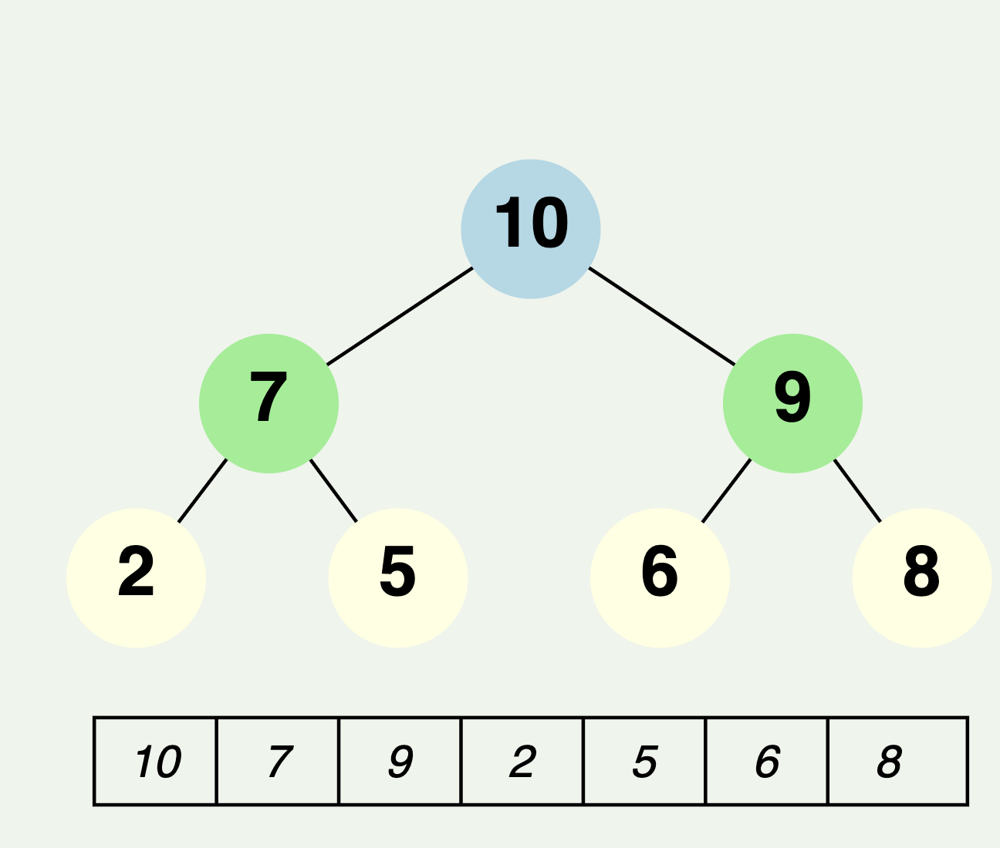

Q: how does max heap and priority queue is implemented internally ? why does polling cost O(logn) ? whats the cost of adding element ? can u explain ?

Answer : Max Heap and Priority Queue Implementation:

1. Structure:
   - A max heap (and by extension, a priority queue) is typically implemented using an array.
   - The array represents a complete binary tree where each node is greater than or equal to its children.
   - For an element at index i:
     - Its left child is at index 2i + 1
     - Its right child is at index 2i + 2
     - Its parent is at index (i - 1) / 2

2. Key Property:
   - In a max heap, the largest element is always at the root (index 0 of the array).

Now, let's look at the main operations:

Adding an Element (offer/add operation):

1. Process:
   - The new element is appended to the end of the array.
   - Then, it's compared with its parent and swapped if it's larger.
   - This process (called "bubble up" or "heapify up") continues until the element is in its correct position.

2. Time Complexity: O(log n)
   - In the worst case, the new element might need to bubble up from the bottom to the top of the heap.
   - The height of a binary heap with n elements is log n.
   - Therefore, the maximum number of swaps is log n.

Polling an Element (poll/remove operation):

1. Process:
   - The root element (at index 0) is removed and returned.
   - The last element in the array is moved to the root position.
   - Then, this element is compared with its children and swapped with the larger child if necessary.
   - This process (called "bubble down" or "heapify down") continues until the element is in its correct position.

2. Time Complexity: O(log n)
   - In the worst case, the element might need to bubble down from the root to a leaf.
   - Again, the height of the heap is log n, so the maximum number of swaps is log n.

Why O(log n)?

The log n time complexity comes from the height of the binary heap. With n elements:
- The heap has log n levels (rounded down).
- Both add and poll operations might traverse the entire height of the tree in the worst case.
- Each level requires at most one comparison and possibly one swap.

Additional Notes:

1. Peeking (getting the max element without removing it) is O(1) because the max element is always at the root.

2. The initial building of a heap from an unsorted array can be done in O(n) time using a bottom-up approach, which is more efficient than inserting n elements one by one.

3. In Java's PriorityQueue implementation, the underlying array grows dynamically, similar to an ArrayList. This amortizes the cost of resizing over multiple operations.



```svg
<svg xmlns="http://www.w3.org/2000/svg" viewBox="0 0 300 200">
  <style>
    .small { font: italic 13px sans-serif; }
    .heavy { font: bold 20px sans-serif; }
  </style>
  
  <!-- Tree structure -->
  <line x1="150" y1="30" x2="75" y2="80" stroke="black" />
  <line x1="150" y1="30" x2="225" y2="80" stroke="black" />
  <line x1="75" y1="80" x2="37" y2="130" stroke="black" />
  <line x1="75" y1="80" x2="112" y2="130" stroke="black" />
  <line x1="225" y1="80" x2="187" y2="130" stroke="black" />
  <line x1="225" y1="80" x2="262" y2="130" stroke="black" />
  
  <!-- Nodes -->
  <circle cx="150" cy="30" r="20" fill="lightblue" />
  <circle cx="75" cy="80" r="20" fill="lightgreen" />
  <circle cx="225" cy="80" r="20" fill="lightgreen" />
  <circle cx="37" cy="130" r="20" fill="lightyellow" />
  <circle cx="112" cy="130" r="20" fill="lightyellow" />
  <circle cx="187" cy="130" r="20" fill="lightyellow" />
  <circle cx="262" cy="130" r="20" fill="lightyellow" />
  
  <!-- Node values -->
  <text x="150" y="35" text-anchor="middle" class="heavy">10</text>
  <text x="75" y="85" text-anchor="middle" class="heavy">7</text>
  <text x="225" y="85" text-anchor="middle" class="heavy">9</text>
  <text x="37" y="135" text-anchor="middle" class="heavy">2</text>
  <text x="112" y="135" text-anchor="middle" class="heavy">5</text>
  <text x="187" y="135" text-anchor="middle" class="heavy">6</text>
  <text x="262" y="135" text-anchor="middle" class="heavy">8</text>
  
  <!-- Array representation -->
  <rect x="25" y="170" width="250" height="25" fill="none" stroke="black" />
  <line x1="60" y1="170" x2="60" y2="195" stroke="black" />
  <line x1="95" y1="170" x2="95" y2="195" stroke="black" />
  <line x1="130" y1="170" x2="130" y2="195" stroke="black" />
  <line x1="165" y1="170" x2="165" y2="195" stroke="black" />
  <line x1="200" y1="170" x2="200" y2="195" stroke="black" />
  <line x1="235" y1="170" x2="235" y2="195" stroke="black" />
  
  <text x="42" y="187" text-anchor="middle" class="small">10</text>
  <text x="77" y="187" text-anchor="middle" class="small">7</text>
  <text x="112" y="187" text-anchor="middle" class="small">9</text>
  <text x="147" y="187" text-anchor="middle" class="small">2</text>
  <text x="182" y="187" text-anchor="middle" class="small">5</text>
  <text x="217" y="187" text-anchor="middle" class="small">6</text>
  <text x="252" y="187" text-anchor="middle" class="small">8</text>
</svg>

```

This diagram illustrates:
1. The tree structure of a max heap
2. How the elements are arranged (largest at the root)
3. The corresponding array representation below

The tree structure shows why operations have O(log n) complexity - any path from root to leaf has length log n. The array representation demonstrates how the heap is actually stored in memory, which allows for efficient indexing and manipulation.

Is there any specific aspect of heap operations or implementation you'd like me to elaborate on further?


Q2: can u explain why The heap has log n levels (rounded down).


A: 2^h - 1 = n 
h = 2log(n-1) 