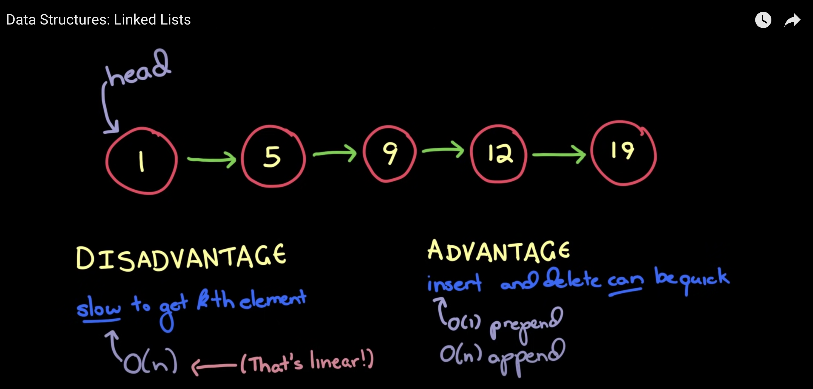
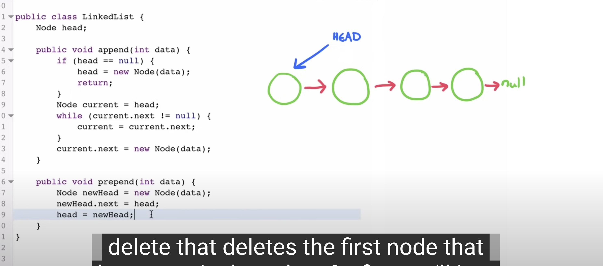
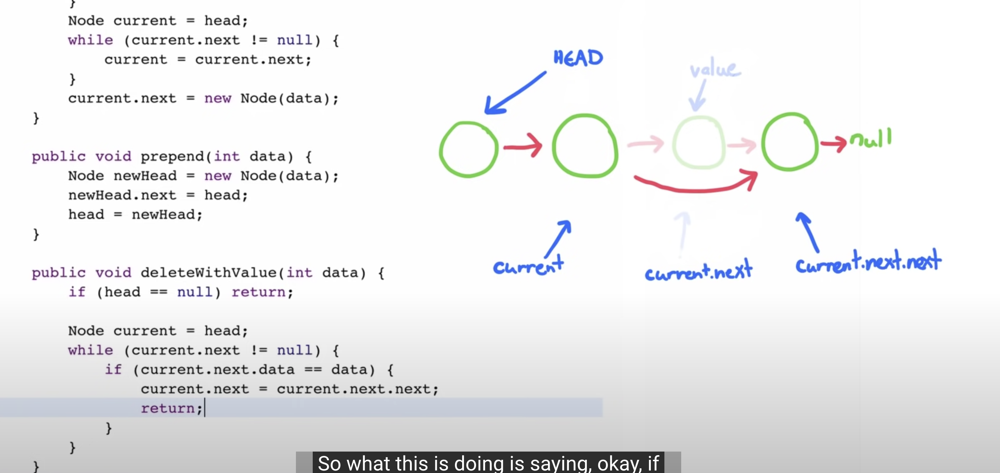
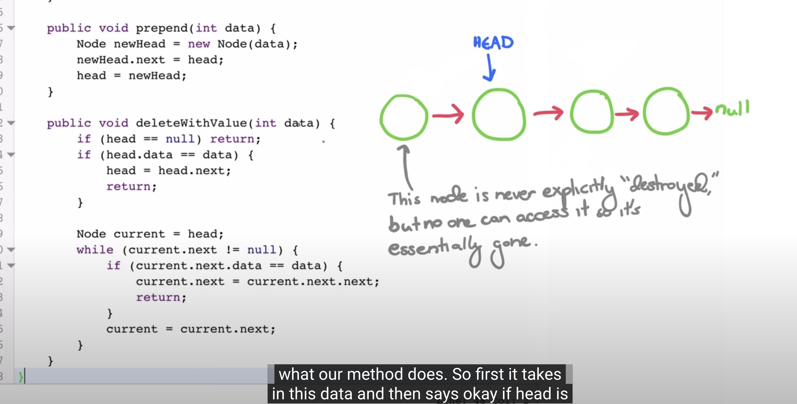

Append & prepend

APPEND AT PARTICULAR INDEX -    

go till index -  1 

temp  = curr.next;

curr.next = newNode

newNode.next = temp ;

Delete 

LL techniques : 

2 pointers - fast and slow : 

